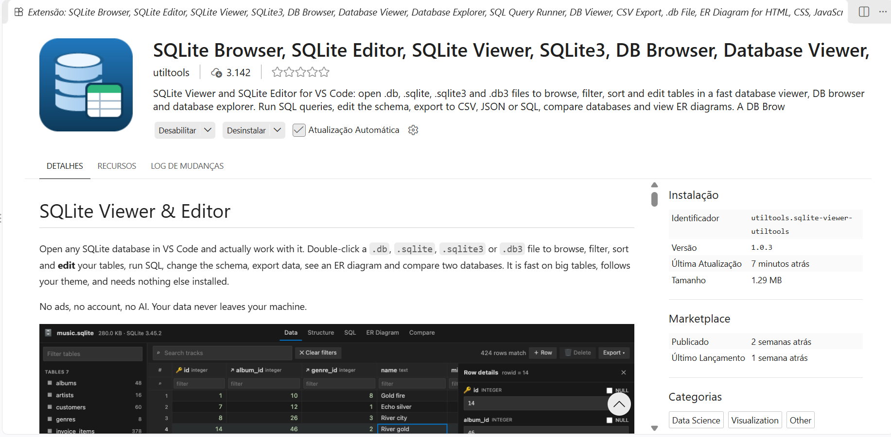

# node-typescript-bd-sqlite-05-dao

### SQLite Viewer and SQLite Editor for VS Code

No Codespace, instalar a extensão (plugin) VS Code `SQLite Viewer and SQLite Editor for VS Code` for VS Code: 



### Iniciar um projeto `Node.js`:

```bash
sudo apt update
```

```bash
sudo apt install -y nodejs
```

```bash
node -v
```

```bash
npm install -g npm@11.19.0
```

```bash
npm -v
```

```bash
npm init -y
```

###  No arquivo `package.json`, substituir `"type": "commonjs",`  por `"type": "module",`:

```json
{
  "name": "typescript-bd-sqlite-05-dao",
  "version": "1.0.0",
  "description": "",
  "main": "index.js",
  "scripts": {
    "test": "echo \"Error: no test specified\" && exit 1"
  },
  "repository": {
    "type": "git",
    "url": "git+https://github.com/wdiasmaciel/node-typescript-bd-sqlite-05-dao.git"
  },
  "keywords": [],
  "author": "",
  "license": "ISC",
  "type": "module",
  "bugs": {
    "url": "https://github.com/wdiasmaciel/node-typescript-bd-sqlite-05-dao/issues"
  },
  "homepage": "https://github.com/wdiasmaciel/node-typescript-bd-sqlite-05-dao#readme"
}
```

###  No arquivo `package.json`, inserir as linhas:
```json
    "dev": "node --watch ./src/Main.ts",
    "start": "npm run dev"
```

```json
{
  "name": "typescript-bd-sqlite-05-dao",
  "version": "1.0.0",
  "description": "",
  "main": "index.js",
  "scripts": {
    "test": "echo \"Error: no test specified\" && exit 1",
    "dev": "node --watch ./src/Main.ts",
    "start": "npm run dev"
  },
  "repository": {
    "type": "git",
    "url": "git+https://github.com/wdiasmaciel/node-typescript-bd-sqlite-05-dao.git"
  },
  "keywords": [],
  "author": "",
  "license": "ISC",
  "type": "module",
  "bugs": {
    "url": "https://github.com/wdiasmaciel/node-typescript-bd-sqlite-05-dao/issues"
  },
  "homepage": "https://github.com/wdiasmaciel/node-typescript-bd-sqlite-05-dao#readme"
}
```
### Executar
 
```bahs
npm start
```

```text

> typescript-bd-sqlite-05-dao@1.0.0 start
> npm run dev


> typescript-bd-sqlite-05-dao@1.0.0 dev
> node --watch ./src/Main.ts

Conexão com SQLite estabelecida!
Tabela 'usuario' criada ou já existe!
Conexão com SQLite estabelecida!

        USUÁRIO GRAVADO NO BANCO DE DADOS: 

        ID: 1

        NOME: Ana

        DATA DE NASCIMENTO: 2000-06-07
      
Conexão com SQLite estabelecida!

        USUÁRIO LIDO DO BANCO DE DADOS: 

        ID: 1

        NOME: Ana

        DATA DE NASCIMENTO: 2000-06-07
      
Conexão com SQLite estabelecida!
O usuário Ana Silva foi atualizado no banco de dados!
Conexão com SQLite estabelecida!

        USUÁRIO LIDO DO BANCO DE DADOS: 

        ID: 1

        NOME: Ana Silva

        DATA DE NASCIMENTO: 2000-06-07
      
Conexão com SQLite estabelecida!
O usuario Ana Silva foi removido do BD.
Conexão com SQLite estabelecida!
Usuário não encontrado!
Conexão com SQLite estabelecida!

        USUÁRIO GRAVADO NO BANCO DE DADOS: 

        ID: 2

        NOME: Bruna

        DATA DE NASCIMENTO: 2006-08-07
      
Conexão com SQLite estabelecida!

        USUÁRIO LIDO DO BANCO DE DADOS: 

        ID: 2

        NOME: Bruna

        DATA DE NASCIMENTO: 2006-08-07
      
Conexão com SQLite estabelecida!
O usuário Bruna Gomes foi atualizado no banco de dados!
Conexão com SQLite estabelecida!

        USUÁRIO LIDO DO BANCO DE DADOS: 

        ID: 2

        NOME: Bruna Gomes

        DATA DE NASCIMENTO: 2006-08-07
      
Conexão com SQLite estabelecida!

        USUÁRIO GRAVADO NO BANCO DE DADOS: 

        ID: 3

        NOME: Carlos Pereira

        DATA DE NASCIMENTO: 2009-11-15
      
Conexão com SQLite estabelecida!

        USUÁRIO LIDO DO BANCO DE DADOS: 

        ID: 3

        NOME: Carlos Pereira

        DATA DE NASCIMENTO: 2009-11-15
      
```

# Exercício

Em Node.js com TypeScript, escreva um algoritmo que:

1. Cadastre veículos no banco de dados SQLite, segundo o padrão "Data Access Object" (DAO). O algoritmo deve permitir que o usuário cadastre quantos veículos forem necessários. A classe Veiculo deve possuir as propriedades: marca, modelo, número do chassi, placa e cor. Após cadastrar todos os veículos, o algoritmo deve permitir:
  - Consultar os veículos cadastrados.
  - Atualizar os veículos cadastrados.
  - Excluir os veículos cadastrados.

2. Implemente o CRUD (Create, Read, Update, Delete) do banco de dados de uma padaria, empregando o padrão "Data Access Object" (DAO). Considere as tabelas:
  - Cliente(id_cliente, nome),
  - Pedido(id_pedido, id_cliente, data_pedido, total),
  - Produto(id_produto, nome, preco) e
  - ItemPedido(id_pedido, id_produto, quantidade).


3. Implemente o CRUD (Create, Read, Update, Delete) do banco de dados de uma agência de viagens, empregando o padrão "Data Access Object" (DAO). Considere as tabelas:
  - Cliente(id_cliente, nome),
  - Reserva(id_reserva, id_cliente, id_destino, data_viagem, valor) e
  - Destino(id_destino, nome_destino, pais).

4. Implemente o CRUD (Create, Read, Update, Delete) do banco de dados de uma clínica médica, empregando o padrão "Data Access Object" (DAO). Considere as tabelas:
  - Paciente(id_paciente, nome),
  - Medico(id_medico, nome, especialidade) e
  - Consulta(id_consulta, id_paciente, id_medico, data_consulta, valor).

5. Implemente o CRUD (Create, Read, Update, Delete) do banco de dados de uma farmácia, empregando o padrão "Data Access Object" (DAO). Considere as tabelas:
  - Medicamento(id_medicamento, nome, preco),
  - Fornecedor(id_fornecedor, nome, cidade) e
  - Compra(id_compra, id_medicamento, id_fornecedor, quantidade, data_compra).